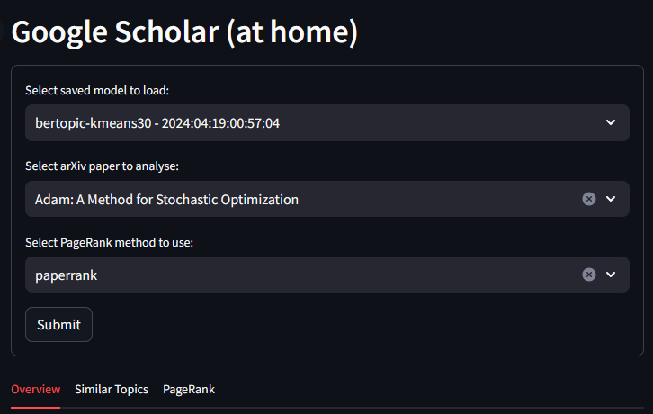

# ArXiv-Dataset-T14

This project is done in fulfilment of CS5246 Text Mining. We are focusing on the open project option where we are looking to do knowledge extraction from the ArXiv Dataset provided by Cornell University.

The dataset can be found at https://www.kaggle.com/datasets/Cornell-University/arxiv

## Setup
1. Clone this repository first and download the dataset from the link above.

2. For co-citation data, download the [co-citation json](https://github.com/mattbierbaum/arxiv-public-datasets/releases/download/v0.2.0/internal-references-v0.2.0-2019-03-01.json.gz). Unzip the file and ensure it is named ```internal-references-pdftotext.json```.

3. Put the two json files into a folder ```archive``` at the root level.

4. You can run the following code snippet to just process the downloaded data into segmented chunks. It will then store it at ```./data/arxiv-cs-papers.csv```
    ```
        load_cs_papers("")
    ```

Or you could also define pre-processing steps to be run. This snippet stores it at ```./data/arxiv-cs-papers-normalized.csv```
```
    load_cs_papers("", "normalized", run_preprocessor=True)
```

5. Recommended: Setup seperate conda environments to run Streamlit app and to train BERTopic model
    ```
    conda env create -f streamlit_env.yml
    conda env create -f bertopic_spacy_env.yml
    ```

    To replicate the bertopic training environment from scratch:
    ```
    conda install -c conda-forge numpy
    conda install -c conda-forge pandas
    conda install -c conda-forge scikit-learn
    conda install -c conda-forge hdbscan
    conda install -c conda-forge spacy
    conda install -c conda-forge cupy
    
    pip install torch torchvision torchaudio --extra-index-url https://download.pytorch.org/whl/cu116
    pip install bertopic
    pip install cuml-cu11 --extra-index-url=https://pypi.nvidia.com
    ```
6. Save trained BERTopic models to `models` folder.
    
    * Download path: [Link](https://drive.google.com/file/d/1QBTCb5KfwFeIhS3eKrMNoYB92T6yt2np/view?usp=drive_link)

### Run KMeans Text Clustering ###
Running KMeans classification needs to open `kmeans_classify.ipynb`.<br>
There are two parameters in the Notebook. They will control:<br>
a. `FAST_RUN_WITH_EXISTING_DATA`: whether re-train the model or just load model from existing pickle file<br>
b. `NORMALIZE_VECTOR`: whether normalize word2vec result<br>


Example:<br>
```
FAST_RUN_WITH_EXISTING_DATA = True
NORMALIZE_VECTOR = False
```
The program will load the existing models and use word2vec to vectorize words<br><br>

```
FAST_RUN_WITH_EXISTING_DATA = False
NORMALIZE_VECTOR = True
```
The program will re-train the models, using word2vec to vectorize words, and normalize the vectorized words. The newly trained model will be put into sub-folder "model_data" and replace the previous models. <br>

After setting the above parameters, run the cells in sequence. <br><br>
Note: You do not need to run the last section: `Model Evaluation` if you do not want to evaluate the model.

### Run Streamlit Application ###

1. Pre-requisite: Ensure that streamlit_env environment and the saved model is properly set-up (Setup Steps 5 & 6)

2. Run the following command to initiatise Streamlit server application locally.
    ```
    streamlit run main.py
    ```
3. Access the web application via http://localhost:8501/
4. If the set-up is successful, the page would be displayed as such:
    
    